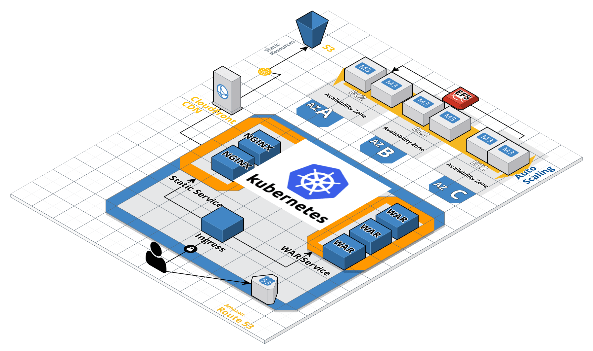

# Infra-java-prevayler-K8S
## Background / Problem
A development team has created a Java web app that is ready for a limited release (with reduced availability and reliability requirements). If the limited release is successful, the app will be rolled out for worldwide use. Once fully public, the application needs to be available 24/7 and must provide sub-second response times and continuity through single-server failures.

Create two environments - one for training and one for production. You should prepare the production environments for the limited release and plan for the scale out during fully public release.

Design and create the training and production environments, and provide a plan to scale out that deployment when the application goes public.

# Solution Roadmap
We need to create infrastructure that is flexible, automatic, consistent, reproducible, and disposable. We will use container solution, orchestrated through Kubernetes, deployed on AWS.

* Setup local development environment for DevOps. Follow [00-start-here/README.md/REAMDME](./00-start-here/README.md)
* Setup development environment. Follow [01-deploy-k8s/REAMDME](./01-deploy-k8s/README.md)
* Setup production environment. Follow [01-deploy-k8s/ REAMDME](./01-deploy-k8s/README.md)

# Principles applied
* Native cloud applications & Microservice architecture
* Infrastructure as Code and Microservices
* PhoenixServer
* One stack definition to manage infrastructure
* TDD & small batches
* The twelve-factor methodology

# Explanation of the decisions
Solution decided to use container to provide microservices solution. there are many concerns, when comes to microservices. For example, service discovery, auto-scaling, self healing, configurations, secrets, etc... This why Kubernetes is a good fit as most of these concerns managed by Kubernetes. Read more about [Kubernetes](!https://kubernetes.io/)

## Why not to go serverless?
Serverless is not a good fit for this java application as it's using Prevayler database to persist data, which write to desk to save its state. Another reason is to avoid vendor lock-in as Kubernetes runs in all cloud providers and available as a service.

# Other Deployment Options
* AWS KES, GKE and Azue AKS
* AWS Fargate
* AWS ECS
* Docker cloud
* EC2 fleet with EFS mounted, using Cloudformation
* EC2 Beanstalk (There will be some work to handle Prevayler)

# Concerns & suggestions application
* Application uses Prevayler, which persist data in the file system at /Users/dcameron/persistence. This is not good for cloud native. pattern and against The twelve-factor methodology IV. *Backing services(Treat backing services as attached resources)*.
* Application is a monolith. It include presentation, business and store layers in one war file.
* Security issues related to using Java serialization
* Caching or read-replica cannot be implemented due to using Prevayler database.
* Designed to scale vertically, but not horizontally.
* All containers need to share the same volume in order to keep the data in sync. This could be done using [Amazon Elastic File System (Amazon EFS)](!https://aws.amazon.com/efs/). Cannot guarantee the performance with thousand concurrent simultaneously writing and reading data.

## Suggestions
* Change the store layer (Prevayler) to use RDSMS, such as Postgres or AWS Aurora, this change will enable  :
  * Read replicas to manage high demand.
  * Multi-az availability
  * Caching
  * Avoid Java serialization vulnerability issues
 * Split the application into Web pages, API gateway and store layers. Then caching between UI, APIs, and store can be easily implemented.

# Links
* Infrastructure as Code and Microservices
* [PhoenixServer](!https://martinfowler.com/bliki/PhoenixServer.html)
* [Kubernetes labs](!https://kumorilabs.com/blog/k8s-0-introduction-blog-series-kubernetes/)
